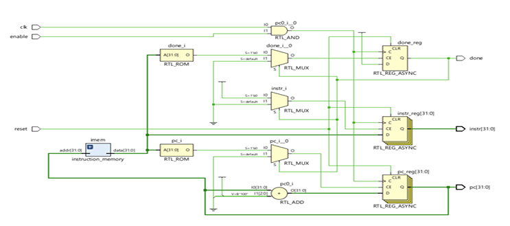
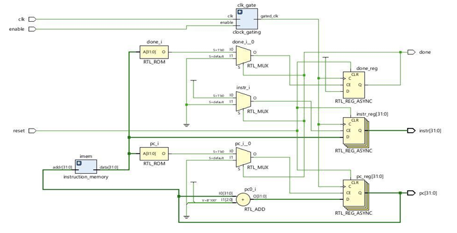
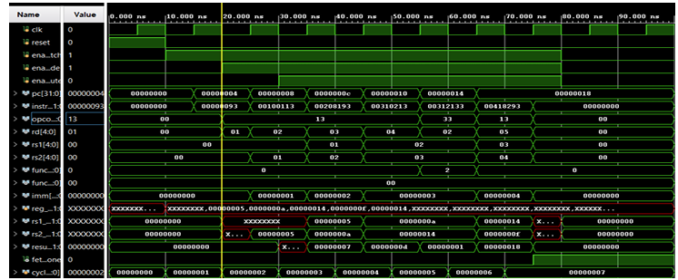
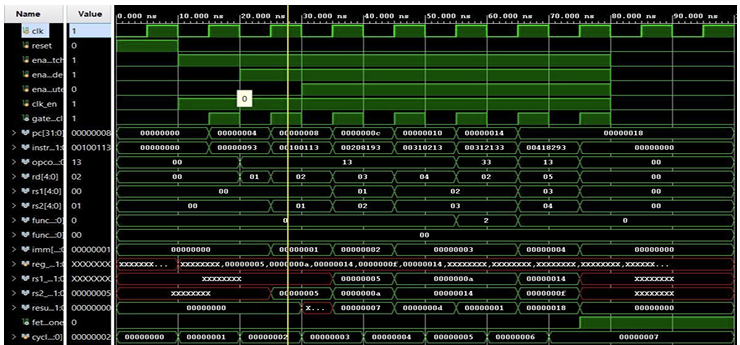

# Power-Optimized 3-Stage Pipelined RISC-V Processor

This project implements a **3-stage pipelined RISC-V processor** optimized for **energy-efficient computing**.  
It uses **enable-control, latch-based clock gating, and data gating techniques** to reduce power consumption.

---

## 🔑 Features
- 3-Stage pipeline: Fetch, Decode, Execute
- Power optimization techniques:
  - Enable control
  - Latch-based clock gating
  - Data gating
- Dynamic power reduced from **0.71 W → 0.03 W**
- Designed in **Verilog HDL**
- Simulated in **EDA Playground** and tested in **Xilinx Vivado (FPGA)**

---

## 📁 Project Structure
```
power-optimized-riscv/
├── src/
│   ├── clock_gating.v
│   ├── instruction_memory.v
│   ├── instruction_fetch.v
│   ├── instruction_decoder.v
│   ├── execute.v
│   └── pipeline.v
├── test/
│   └── testbench.v
└── README.md
```

---

## ⚡ Power Optimization Results

| Design Version                          | Dynamic Power |
|-----------------------------------------|---------------|
| 3-Stage RISC-V (baseline)               | **0.71 W**    |
| 3-Stage RISC-V Pipelined                | **0.63 W**    |
| Pipeline with Enable Control            | **0.13 W**    |
| Pipeline with Latch-Based Clock Gating  | **0.10 W**    |
| Pipeline with Data Gating               | **0.03 W**    |

---

## 🛠 Tools Used
- **EDA Playground** – Simulation & Verification
- **Xilinx Vivado** – FPGA synthesis & power analysis
- **Verilog HDL** – Hardware description language

---

## 🚀 How to Run
1. Clone the repository:
   ```bash
   git clone https://github.com/<your-username>/power-optimized-riscv.git
   cd power-optimized-riscv
   ```
2. Open files in **EDA Playground** or **Xilinx Vivado**.
3. Use `pipeline.v` as the top module.
4. Add `test/testbench.v` as the testbench.
5. Run the simulation and observe waveforms and results.

---

## 📖 Abstract
This project presents a 3-stage pipelined RISC-V processor optimized for energy-efficient computing.  
Using enable control, latch-based clock gating, and data gating, the design reduces dynamic power from 0.71 W to 0.03 W while maintaining throughput, making it highly suitable for low-power IoT and embedded applications.

---

## 👨‍💻 Authors
- M. Pavan Kumar  
- P. V. Satya Bala  
- M. Sai Likhith  
- M. Divya Teja  

---

## Circuit Diagram
### 🔹 Data Gating


### 🔹 Clock Gating


## 📊 Simulation Output

### 🔹 Data Gating


### 🔹 Clock Gating



